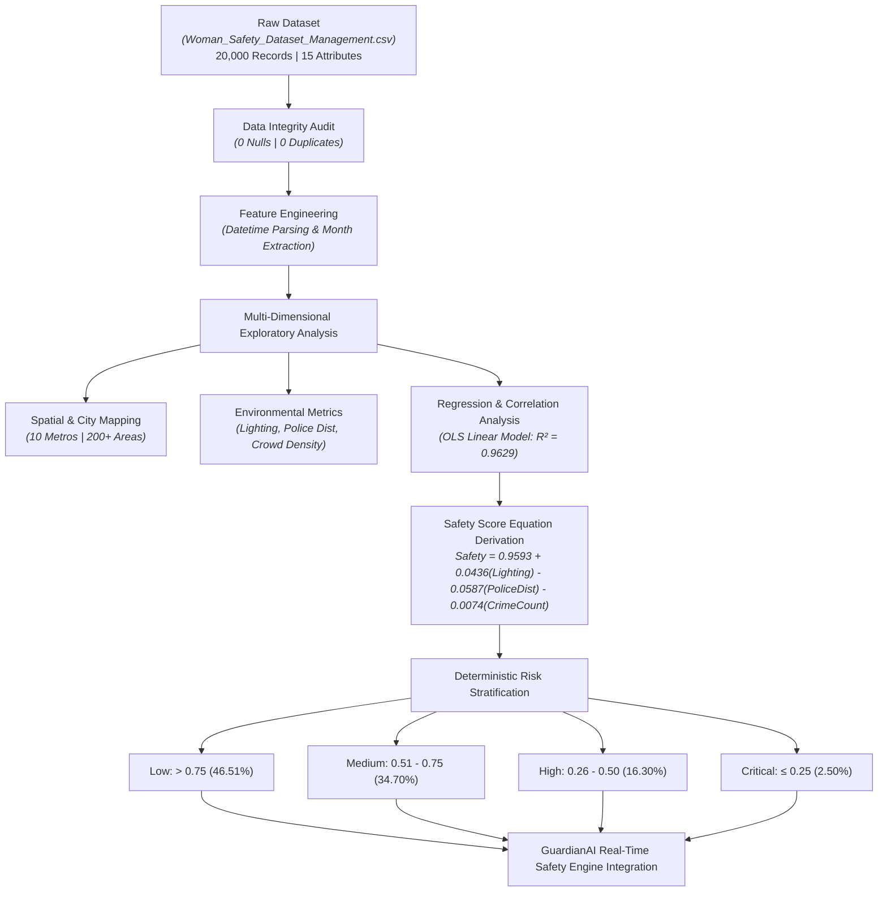

# 🛡️ GuardianAI - Safety Data Analysis & Deep Dataset Documentation

This directory contains the deep exploratory data analysis (EDA), statistical reverse-engineering, and architectural recommendations for the **GuardianAI** safety prediction and route-risk estimation system, based on [`Woman_Safety_Dataset_Management.csv`](file:///h:/Github/GuardianAI/Analysis/Woman_Safety_Dataset_Management.csv).

---

## 📌 File Index & Dataset Source

- **[`Woman_Safety_Dataset_Management.csv`](file:///h:/Github/GuardianAI/Analysis/Woman_Safety_Dataset_Management.csv)**: Primary dataset comprising 20,000 incident logs across 10 major Indian metropolitan areas with spatial, temporal, and environmental features.
- **🌐 Kaggle Dataset Source:** [Indian Women Safety Geospatial Dataset](https://www.kaggle.com/datasets/soumyodipthanadar/indian-women-safety-geospatial-dataset)
- **[`report.md`](file:///h:/Github/GuardianAI/Analysis/report.md)**: Exhaustive Markdown analytical report covering all statistical models, city comparative matrices, risk stratifications, and cross-tabulations.
- **[`report.ipynb`](file:///h:/Github/GuardianAI/Analysis/report.ipynb)**: Primary Jupyter Notebook executing data cleaning, statistical modeling, visualizations, and safety score distributions.

---

## 🔄 Analysis Workflow Flowchart

---

## 📊 Dataset Schema & Data Integrity Profile

- **Total Sample Size:** 20,000 observations
- **Attribute Count:** 15 base columns + 1 derived column (`Month`)
- **Missing Values:** `0` across all fields
- **Duplicate Rows:** `0`

### Exhaustive Feature Schema

| Feature Name | Data Type | Range / Values | Physical Meaning & Operational Role |
| :--- | :---: | :---: | :--- |
| `incident_id` | `str` (UUID) | 36 chars | Unique primary key identifier for each reported incident. |
| `city` | `str` | 10 Metros | Metropolitan area (Bengaluru, Bhopal, Chennai, Delhi, Hyderabad, Jaipur, Kolkata, Lucknow, Mumbai, Patna). |
| `area` | `str` | Text | Specific sub-locality/neighborhood within the city. |
| `latitude` | `float64` | `12.87` – `28.72` | WGS84 latitude coordinate. |
| `longitude` | `float64` | `72.76` – `88.46` | WGS84 longitude coordinate. |
| `crime_type` | `str` | 10 Categories | Specific incident classification (Assault, Chain Snatching, Cyber Crime, Domestic Violence, Harassment, Kidnapping, Night Safety Complaint, Stalking, Unsafe Transport, Verbal Abuse). |
| `crime_count` | `int64` | `0` – `85` | Historical volume of crimes logged in the surrounding spatial radius. |
| `time_of_day` | `str` | 5 Categories | Operational time window (`Morning`, `Afternoon`, `Evening`, `Night`, `Late Night`). |
| `lighting_score` | `float64` | `1.00` – `10.00` | Street illumination index (1.0 = pitch dark, 10.0 = bright illumination). |
| `police_station_distance_km` | `float64` | `0.20` – `8.00` | Euclidean/road distance to the nearest operational police station in km. |
| `crowd_density` | `int64` | `10` – `1,000` | Estimated pedestrian/bystander density per square kilometer. |
| `weather_condition` | `str` | 5 Categories | Atmospheric state during incident (`Clear`, `Foggy`, `Humid`, `Rainy`, `Stormy`). |
| `safety_score` | `float64` | `0.00` – `1.00` | Normalized safety index (0.0 = extreme hazard, 1.0 = high safety). |
| `risk_level` | `str` | 4 Levels | Stratified risk categorization (`Low`, `Medium`, `High`, `Critical`). |
| `incident_timestamp` | `str` / `datetime` | ISO Timestamp | Exact timestamp of incident recording. |
| `Month` | `str` | Jan – Dec | *(Derived)* Name of the month extracted from `incident_timestamp`. |

---

## 🧮 Mathematical Derivation of `safety_score`

Through Ordinary Least Squares (OLS) regression modeling, the dataset's `safety_score` exhibits a near-deterministic linear relationship ($R^2 = 0.9629$, $\text{MAE} = 0.0275$) with three primary environmental variables:

$$\text{Safety}_{\text{Score}} \approx 0.95934 + 0.04362 \times \text{Lighting}_{\text{Score}} - 0.05866 \times \text{PoliceDist}_{\text{km}} - 0.00735 \times \text{Crime}_{\text{Count}}$$

### Feature Influence Breakdown
1. **Police Station Distance ($\beta = -0.05866$):** Every additional kilometer from a police station reduces the safety score by $\approx 0.0587$ points (strongest negative factor).
2. **Lighting Score ($\beta = +0.04362$):** Every unit increase in illumination improves the safety score by $\approx 0.0436$ points (strongest positive factor).
3. **Historical Crime Count ($\beta = -0.00735$):** Every 10 additional historical crimes reduce the safety score by $\approx 0.0735$ points.
4. **Crowd Density & Weather ($\beta \approx 0.0000$):** Negligible direct linear impact on the base safety score algorithm.

---

## 🎯 Risk Level Classification & Stratification

Risk levels are strictly bucketed based on the computed `safety_score`:

$$\text{Risk Level} = \begin{cases} \mathbf{Low} & \text{if } \text{Safety}_{\text{Score}} > 0.75 \\ \mathbf{Medium} & \text{if } 0.50 < \text{Safety}_{\text{Score}} \le 0.75 \\ \mathbf{High} & \text{if } 0.25 < \text{Safety}_{\text{Score}} \le 0.50 \\ \mathbf{Critical} & \text{if } \text{Safety}_{\text{Score}} \le 0.25 \end{cases}$$

### Stratified Metrics by Risk Level

| Risk Level | Sample Count | Share (%) | Mean Safety Score | Mean Lighting Score | Mean Police Dist (km) | Mean Crime Count | Mean Crowd Density |
| :--- | :---: | :---: | :---: | :---: | :---: | :---: | :---: |
| **Low** | 9,301 | 46.51% | $0.9083 \pm 0.0840$ | $6.7001 \pm 2.2968$ | $2.9359 \pm 1.8945$ | $23.52 \pm 14.16$ | $504.38 \pm 285.34$ |
| **Medium** | 6,940 | 34.70% | $0.6381 \pm 0.0712$ | $4.9414 \pm 2.4267$ | $4.6424 \pm 2.0291$ | $35.95 \pm 15.54$ | $501.84 \pm 283.47$ |
| **High** | 3,260 | 16.30% | $0.4055 \pm 0.0680$ | $3.6907 \pm 2.0006$ | $5.9215 \pm 1.5448$ | $46.11 \pm 13.08$ | $513.74 \pm 287.03$ |
| **Critical** | 499 | 2.50% | $0.1779 \pm 0.0593$ | $2.4686 \pm 1.1659$ | $7.0254 \pm 0.8000$ | $57.26 \pm 8.94$ | $509.19 \pm 286.97$ |

---

## 🏙️ City-Level Comparative Matrix

The dataset covers 10 Indian cities uniformly distributed with ~1,920 to ~2,040 incident logs per city:

| City | Incident Count | Total Crime Volume | Avg Crime / Incident | Avg Safety Score | Avg Lighting Score | Avg Police Dist (km) | High + Critical Incidents |
| :--- | :---: | :---: | :---: | :---: | :---: | :---: | :---: |
| **Bhopal** | 2,043 | 67,843 | 33.21 | 0.7203 | 5.58 | 4.02 | 351 |
| **Bengaluru** | 2,000 | 65,610 | 32.81 | 0.7112 | 5.45 | 4.09 | 379 |
| **Chennai** | 2,026 | 65,185 | 32.17 | 0.7168 | 5.47 | 4.07 | 389 |
| **Jaipur** | 2,021 | 65,148 | 32.24 | 0.7094 | 5.39 | 4.16 | 375 |
| **Lucknow** | 2,016 | 65,099 | 32.29 | 0.7167 | 5.52 | 4.09 | 383 |
| **Mumbai** | 2,019 | 64,740 | 32.07 | 0.7082 | 5.41 | 4.17 | 403 |
| **Kolkata** | 2,014 | 64,730 | 32.14 | 0.7124 | 5.50 | 4.16 | 385 |
| **Patna** | 2,015 | 64,227 | 31.87 | 0.7149 | 5.48 | 4.16 | 388 |
| **Hyderabad** | 1,921 | 62,800 | 32.69 | 0.7166 | 5.57 | 4.09 | 362 |
| **Delhi** | 1,925 | 61,755 | 32.08 | 0.7169 | 5.57 | 4.16 | 344 |

---

## 📌 Top High-Risk Localities Nationwide

The top 10 lowest average safety score areas across the dataset:

| City | Local Area | Total Logs | Avg Safety Score | High/Critical Logs | Avg Police Dist (km) | Avg Lighting |
| :--- | :--- | :---: | :---: | :---: | :---: | :---: |
| **Jaipur** | Vaishali Nagar | 412 | 0.6892 | 77 | 4.15 | 5.15 |
| **Mumbai** | Dadar | 399 | 0.6921 | 87 | 4.28 | 5.30 |
| **Kolkata** | Dum Dum | 398 | 0.6983 | 86 | 4.37 | 5.44 |
| **Lucknow** | Aliganj | 373 | 0.7006 | 79 | 4.12 | 5.28 |
| **Hyderabad** | Gachibowli | 382 | 0.7012 | 82 | 4.12 | 5.30 |
| **Bengaluru** | Whitefield | 386 | 0.7017 | 82 | 4.15 | 5.36 |
| **Patna** | Rajendra Nagar | 404 | 0.7018 | 85 | 4.28 | 5.34 |
| **Lucknow** | Hazratganj | 425 | 0.7021 | 90 | 4.28 | 5.44 |
| **Mumbai** | Andheri | 414 | 0.7037 | 85 | 4.24 | 5.35 |
| **Bengaluru** | Yelahanka | 365 | 0.7042 | 78 | 4.10 | 5.49 |

---

## 📑 Cross-Tabulation Analysis

### 1. Crime Type Distribution Across Risk Levels

| Crime Category | Critical | High | Medium | Low | Total Count |
| :--- | :---: | :---: | :---: | :---: | :---: |
| **Night Safety Complaint** | 46 | 330 | 705 | 966 | 2,047 |
| **Cyber Crime** | 50 | 323 | 715 | 957 | 2,045 |
| **Harassment** | 61 | 315 | 721 | 939 | 2,036 |
| **Stalking** | 49 | 314 | 713 | 960 | 2,036 |
| **Verbal Abuse** | 52 | 329 | 673 | 946 | 2,000 |
| **Assault** | 48 | 297 | 738 | 916 | 1,999 |
| **Kidnapping** | 45 | 337 | 661 | 949 | 1,992 |
| **Unsafe Transport** | 44 | 347 | 661 | 926 | 1,978 |
| **Chain Snatching** | 54 | 326 | 680 | 878 | 1,938 |
| **Domestic Violence** | 50 | 342 | 673 | 864 | 1,929 |

### 2. Time of Day vs. Risk Category

| Time Window | Critical | High | Medium | Low | Total Count |
| :--- | :---: | :---: | :---: | :---: | :---: |
| **Night** (20:00 - 00:00) | 96 | 688 | 1,385 | 1,892 | 4,061 |
| **Evening** (16:00 - 20:00) | 97 | 630 | 1,409 | 1,893 | 4,029 |
| **Morning** (06:00 - 12:00) | 112 | 611 | 1,414 | 1,850 | 3,987 |
| **Afternoon** (12:00 - 16:00) | 83 | 643 | 1,415 | 1,837 | 3,978 |
| **Late Night** (00:00 - 06:00) | 111 | 688 | 1,317 | 1,829 | 3,945 |

### 3. Weather Condition Distribution

The 20,000 incident logs are evenly distributed across 5 atmospheric states (~20% per category):

| Weather Condition | Frequency (Count) | Percentage (%) |
| :--- | :---: | :---: |
| **Clear** | 4,054 | 20.27% |
| **Stormy** | 4,032 | 20.16% |
| **Rainy** | 4,016 | 20.08% |
| **Humid** | 3,971 | 19.86% |
| **Foggy** | 3,927 | 19.63% |

### 4. Monthly Temporal Analysis (Total Crime Volume)

Derived by extracting month names from `incident_timestamp`:

| Month | Total Crime Volume | Percentage (%) |
| :--- | :---: | :---: |
| **January** | 53,357 | 8.24% |
| **February** | 49,842 | 7.69% |
| **March** | 55,229 | 8.52% |
| **April** | 50,487 | 7.79% |
| **May** | 59,012 | 9.11% |
| **June** | 51,002 | 7.87% |
| **July** | 57,749 | 8.91% |
| **August** | 54,570 | 8.42% |
| **September** | 53,275 | 8.22% |
| **October** | 54,961 | 8.48% |
| **November** | 53,958 | 8.33% |
| **December** | 53,695 | 8.29% |

---

## 💡 Engineering Recommendations for GuardianAI System

1. **Real-Time Safety Score Calculation:**
   Implement the exact regression formula in GuardianAI's backend algorithm:
   $$\text{Safety}_{\text{Score}} = 0.9593 + 0.0436 \cdot \text{Lighting} - 0.0587 \cdot \text{PoliceDist}_{\text{km}} - 0.0074 \cdot \text{Crime}_{\text{Count}}$$
2. **Proactive Rerouting Triggers:**
   Trigger emergency notifications or suggest alternative paths whenever a user's planned route crosses segments where:
   - `police_station_distance_km` $> 5.0\text{ km}$ AND `lighting_score` $< 4.0$
   - Computed $\text{Safety}_{\text{Score}} \le 0.50$ (High/Critical risk thresholds).
3. **IOT & Street Illumination Integration:**
   Since lighting score provides a direct $+0.0436$ safety boost per unit, integrate municipal IoT street light status feeds into GuardianAI to provide dynamic night routing.

---

## 👥 Project Team & Contributors

- 👤 [Pampana Satya Kiran](http://psatyakiran.in/)
- 👤 **Amarthaluri Harshavardhan**
- 👤 **Madeli Narasimha**
- 👤 **Mammula Sneha**
- 👤 **Kadagala Meghana**

