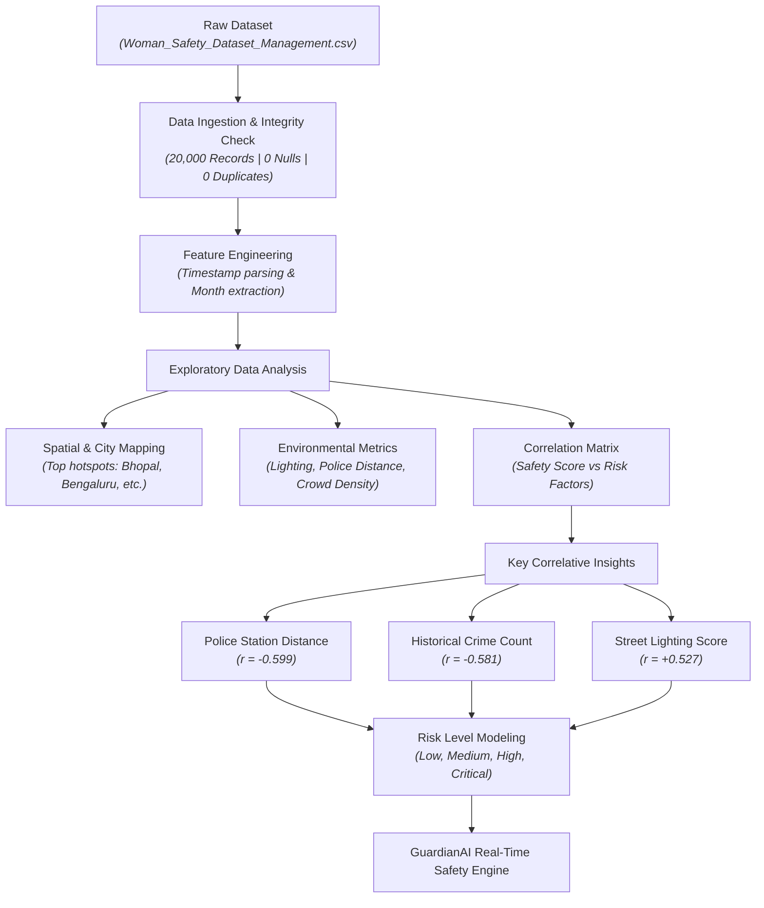

# 🛡️ GuardianAI - Safety Data Analysis

This directory contains the exploratory data analysis (EDA) and dataset documentation for the **GuardianAI** safety prediction system.

---

## 📌 Contents

- **`Woman_Safety_Dataset_Management.csv`**: Dataset containing 20,000 incident logs across 10 Indian cities with environmental, spatial, and temporal features.
- **[`Untitled.ipynb`](file:///h:/Github/GuardianAI/Analysis/Untitled.ipynb)**: Jupyter Notebook containing data cleaning, descriptive statistics, feature correlations, and safety distribution analysis.

---

## 📊 Dataset Overview

- **Total Rows:** 20,000
- **Total Features:** 15 base columns + 1 derived column (`Month`)
- **Data Quality:** 0 missing values, 0 duplicate rows

### Feature Schema

| Feature Name | Data Type | Description |
| :--- | :---: | :--- |
| `incident_id` | `str` | Unique identifier (UUID) for each incident log |
| `city` | `str` | City name (e.g., Bhopal, Chennai, Jaipur, Mumbai, Bengaluru, etc.) |
| `area` | `str` | Local neighborhood/locality within the city |
| `latitude` | `float` | Geographical latitude coordinate |
| `longitude` | `float` | Geographical longitude coordinate |
| `crime_type` | `str` | Type of incident reported (e.g., Assault, Cyber Crime, Stalking, etc.) |
| `crime_count` | `int` | Historical incident count in the region (Range: 0 - 85) |
| `time_of_day` | `str` | Categorical time frame (Morning, Afternoon, Evening, Night, Late Night) |
| `lighting_score` | `float` | Street lighting quality rating (Range: 1.0 - 10.0) |
| `police_station_distance_km` | `float` | Distance to the nearest police station in kilometers (Range: 0.2 - 8.0 km) |
| `crowd_density` | `int` | Estimate of people density per area (Range: 10 - 1000) |
| `weather_condition` | `str` | Weather during incident (Clear, Rainy, Stormy, Foggy, Humid) |
| `safety_score` | `float` | Calculated safety score (Range: 0.0 - 1.0) |
| `risk_level` | `str` | Risk category (`Low`, `Medium`, `High`, `Critical`) |
| `incident_timestamp` | `str` / `datetime` | Date & time of the recorded incident |
| `Month` | `str` | *(Derived)* Name of the month extracted from `incident_timestamp` |

---

## 🔄 Analysis Workflow Flowchart



---

## 📈 Key Insights & Analysis Findings

### 1. Primary Safety Score Predictors
Correlation analysis against `safety_score` highlights key factors influencing safety:

- **Police Station Proximity (`police_station_distance_km`):** **`-0.599` correlation**  
  *Closer proximity to a police station strongly increases the safety score.*
- **Historical Crime Volume (`crime_count`):** **`-0.581` correlation**  
  *Higher crime counts significantly depress local safety scores.*
- **Infrastructure & Lighting (`lighting_score`):** **`+0.527` correlation**  
  *Well-lit areas significantly elevate the overall safety rating.*
- **Crowd Density (`crowd_density`):** **`-0.009` correlation**  
  *Crowd density alone shows no direct linear effect on safety score.*

### 2. Risk Level vs. Police Station Distance
Mean distance to nearest police station across risk levels:
- **Low Risk:** `2.94 km`
- **Medium Risk:** `4.64 km`
- **High Risk:** `5.92 km`
- **Critical Risk:** `7.03 km`

### 3. High Risk Incident Profile
- **3,260 records (16.3%)** are classified under **High** risk level.
- Top city hotspots with high aggregated incident counts include **Bhopal**, **Bengaluru**, **Chennai**, and **Jaipur**.
- High-incident localities include *Lajpat Nagar*, *Velachery*, *Malviya Nagar*, *Electronic City*, and *Garia*.

### 4. Temporal Distribution
- Crime counts peak mid-year in **May** (~59,000 total crimes) and **July** (~57,700 total crimes).

---

## 🚀 How to Run the Analysis Notebook

1. Ensure Python 3.8+ and Jupyter Notebook are installed.
2. Install required packages:
   ```bash
   pip install pandas matplotlib seaborn notebook
   ```
3. Launch Jupyter Notebook and open [`Untitled.ipynb`](file:///h:/Github/GuardianAI/Analysis/Untitled.ipynb):
   ```bash
   jupyter notebook Analysis/Untitled.ipynb
   ```

---

## 💡 Recommendations for GuardianAI System

1. **Risk Scoring Engine:** Weight `police_station_distance_km`, `lighting_score`, and localized `crime_count` heavily in real-time safety score algorithms.
2. **Dynamic Route Guidance:** Trigger warnings or reroute users when paths pass through areas with lighting scores $< 4.0$ or police station distances $> 5.0\text{ km}$.
