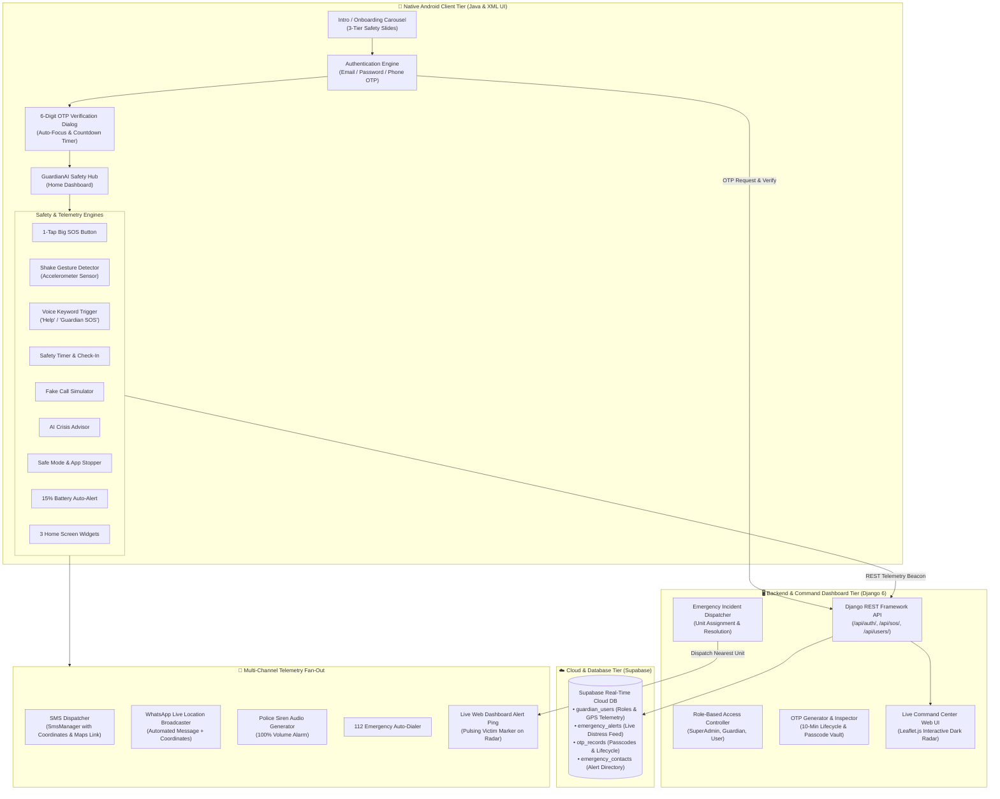
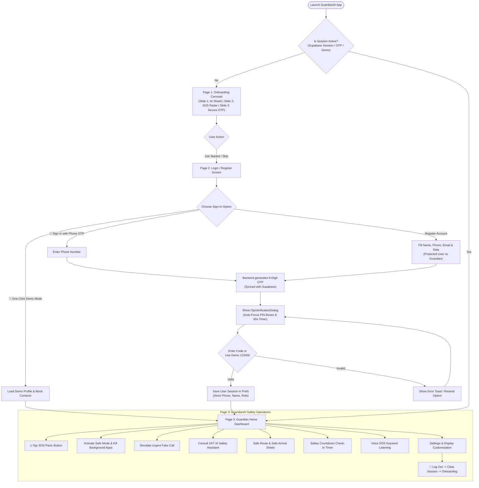
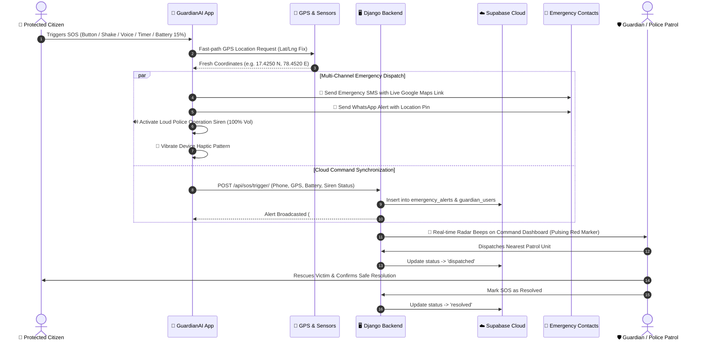

<div align="center">
  # 🛡️ GuardianAI
  ### *Autonomous Women Safety, Telemetric Emergency Response & Cloud Command Platform*

  [](https://developer.android.com/)
  [](https://www.djangoproject.com/)
  [](https://supabase.com/)
  [](LICENSE)
</div>

---

## 📌 Table of Contents
1. [Overview & Mission](#-overview--mission)
2. [End-to-End System Architecture](#-end-to-end-system-architecture)
3. [Multi-Role Access Control Model](#-multi-role-access-control-model)
4. [Application Lifecycle & Onboarding Flowchart](#-application-lifecycle--onboarding-flowchart)
5. [Emergency SOS Telemetry & Dispatch Flowchart](#-emergency-sos-telemetry--dispatch-flowchart)
6. [Key Features Breakdown](#-key-features-breakdown)
7. [Django & Supabase Cloud Command Dashboard](#-django--supabase-cloud-command-dashboard)
8. [Admin User Data Management System](#-admin-user-data-management-system)
9. [REST API Reference](#-rest-api-reference)
10. [Installation & Setup Guide](#-installation--setup-guide)
11. [Secure Cloud Hosting Guide (HOST.md)](HOST.md)
12. [Engineering Team](#-engineering-team)

---

## 🌟 Overview & Mission

**GuardianAI** is a mission-critical personal safety and rapid emergency response ecosystem designed specifically for women and vulnerable citizens. The platform connects a native **Android Client (Java + XML UI)** with an intelligent **Django 6 + Supabase Cloud Command Dashboard**, offering autonomous panic detection, real-time GPS telemetry, instant police/guardian dispatching, and dynamic 6-digit OTP security.

---

## 🏗️ End-to-End System Architecture

The GuardianAI ecosystem operates across four interconnected tiers: **Client Tier**, **Application & REST Tier**, **Cloud Database Tier**, and **Multi-Channel Dispatch Channels**.



---

## 👥 Multi-Role Access Control Model

GuardianAI structures users into three distinct security tiers:

| Role | Badge | Permissions & Capabilities | Target Audience |
| :--- | :---: | :--- | :--- |
| **SuperAdmin** | `👑 SUPERADMIN` | System-wide command over all users, live incident dispatches, audit logs, OTP transaction inspection, and system metrics. | System Administrators, Law Enforcement Leads |
| **Guardian** | `🛡️ GUARDIAN` | Receives real-time proximity distress alerts, assigned to victims, views live GPS telemetry, and confirms safety resolution. | Verified Patrol Units, SHE Teams, Campus Security, Parents |
| **Protected User** | `🌸 USER` | Access to 1-Tap SOS, Shake & Voice Detection, AI Safety Assistant, Safe Route, Fake Call, Safety Timer, and Emergency Contacts. | Women, Students, Solo Commuters, Citizens |

---

## 🔄 Application Lifecycle & Onboarding Flowchart



---

## 🚨 Emergency SOS Telemetry & Dispatch Flowchart

When an emergency occurs, GuardianAI dispatches telemetry simultaneously across offline and online channels in **under 2 seconds**:



---

## ⚡ Key Features Breakdown

### 📱 Android Application (Java & XML UI)
- **1-Tap Panic SOS Button**: Big pulsating emergency trigger with countdown cancellation dialog.
- **Shake Detection**: Background accelerometer listener that sends SOS upon vigorous device shake.
- **Voice SOS Keyword Detection**: Hands-free trigger using predefined safety phrases (*"Help"*, *"Guardian SOS"*, *"Save Me"*).
- **Fake Call Simulator**: Realistic incoming call simulator with customizable caller names (*Mom 💖*, *Boss*) and audio playback to gracefully escape uncomfortable situations.
- **24/7 AI Safety Assistant**: Crisis advisor offering real-time advice on stalking, public transit safety, self-defense moves, and legal rights.
- **Safe Mode Engine**: Stops battery-draining background apps to maximize tracking battery life and broadcasts live location via WhatsApp and SMS.
- **Safety Timer & Check-In**: Dead-man's switch countdown that automatically alerts guardians if a check-in is missed.
- **Taxi & Trip Monitoring**: Logs cab numbers and driver details with abnormal route diversion alerts.
- **15% Battery Guardian Alert**: Automatic emergency GPS broadcast to parents/guardians before device power depletion.
- **3 Home Screen Widgets**: 1-Tap SOS (2x2), Guardian Safety Hub (4x2), and Quick Safety Bar (4x1).
- **Theme & Multilingual Engine**: Light mode, Dark mode, Pure AMOLED Black mode 🖤, localized in **English 🇬🇧**, **Telugu 🇮🇳 (తెలుగు)**, and **Hindi 🇮🇳 (हिन्दी)**.
- **Settings & Safe Session Logout**: Comprehensive preferences suite with session clearance and account sign-out.

---

## 🖥️ Django & Supabase Cloud Command Dashboard

The GuardianAI Web Dashboard provides a **cyber-glassmorphism dark UI** for command center operators:

- **Interactive OpenFreeMap Telemetric Radar**: Displays live victim SOS beacons with expanding red radar waves and green shield pins for Guardian responders using **OpenFreeMap** (100% free, zero rate-limits, no API keys required, with Dark Radar, Liberty Street, and Bright layer switchers).
- **Live Emergency Feed**: Instant action triggers for *"Dispatch Nearest Guardian"* and *"Confirm Safe Resolution"*.
- **Role Switcher Tabs**: Filter live command desk by SuperAdmin, Guardian, or User view.
- **OTP Security Inspector & Simulator**: Live transaction ledger with an interactive testing tool to dispatch and verify passcodes.

---

## 👑 Admin User Data Management System

The Admin Dashboard provides full CRUD data controls at **[`/users/`](http://127.0.0.1:8000/users/)**:

- **✏️ Comprehensive User Data Editor (Modal)**:
  - Edit personal details: Full Name, Phone Number, Email Address.
  - Modify security roles (`👑 SuperAdmin`, `🛡️ Guardian`, `🌸 Protected User`).
  - Update live telemetry: Street Address, GPS Latitude, GPS Longitude, and Device Battery (%).
  - Toggle verification status (`is_verified`) and account status (`is_active`).
  - **Instant Supabase Cloud Sync**: All changes automatically push to Supabase `guardian_users`.
- **➕ Create User Records**: Quick account creator with pre-verification options.
- **🔄 1-Click Role Switcher**: Change permissions directly from the table dropdown.
- **📥 CSV Data Export**: Download full system user records (`guardian_ai_users.csv`) for security audits.
- **🗑️ Safe Deletion**: Permanently remove accounts with confirmation safety dialogs.

---

## 🔌 REST API Reference

| Endpoint | Method | Description | Sample Payload |
| :--- | :---: | :--- | :--- |
| `/api/auth/send-otp/` | `POST` | Generate & dispatch 6-digit OTP | `{"target": "+919876543210", "purpose": "login"}` |
| `/api/auth/verify-otp/` | `POST` | Validate 6-digit passcode | `{"target": "+919876543210", "otp_code": "123456"}` |
| `/api/auth/register/` | `POST` | Create account with role & cloud sync | `{"name": "Sneha", "phone": "+919876543210", "role": "user"}` |
| `/api/auth/login/` | `POST` | Sign in via password or phone OTP | `{"identifier": "+919876543210", "otp_code": "123456"}` |
| `/api/sos/trigger/` | `POST` | Broadcast emergency distress beacon | `{"phone": "+919876543210", "latitude": 17.425, "longitude": 78.452}` |
| `/api/sos/resolve/` | `POST` | Mark alert resolved | `{"alert_id": 1, "notes": "Safely resolved"}` |
| `/api/location/ping/` | `POST` | Update victim live GPS telemetry | `{"phone": "+919876543210", "latitude": 17.425, "longitude": 78.452}` |
| `/api/dashboard/stats/` | `GET` | Fetch real-time metrics & recent alerts | *None* |

---

## 🚀 Installation & Setup Guide

### 1. Backend & Dashboard Setup (Django + Supabase)
```bash
# Navigate to backend directory
cd backend

# Configure environment secrets
cp .env.example .env

# Run database migrations
python manage.py makemigrations guardian_api
python manage.py migrate

# Seed multi-role demo data
python manage.py seed_demo_data

# Start local server on port 8000
python manage.py runserver 127.0.0.1:8000
```
Visit **[http://127.0.0.1:8000/](http://127.0.0.1:8000/)** in your browser to access the live command center.

### 2. Android Mobile App Setup
- Open the root project in **Android Studio** (Giraffe or above).
- Build the debug APK via Gradle:
```powershell
.\gradlew.bat assembleDebug
```
- The compiled APK is generated at `app/build/outputs/apk/debug/app-debug.apk`.

---

## 👥 Engineering Team

- 👤 **[Pampana Satya Kiran](http://psatyakiran.in/)** — *Lead Developer & System Architect*
- 👤 **Amarthaluri Harshavardhan** — *Core Android & Security Engineer*
- 👤 **Madeli Narasimha** — *Backend & Cloud Integration*
- 👤 **[Mammula Sneha](https://www.linkedin.com/in/sneha-mammula-b0651832a/)** — *UI/UX & Safety Systems*
- 👤 **Kadagala Meghana** — *QA & Location Telemetry*

---

## 🤝 Credits & Inquiries
- Website: [psatyakiran.in](http://psatyakiran.in/)
- In-App Icons: [icons8.com](https://icons8.com) & Material Symbols
