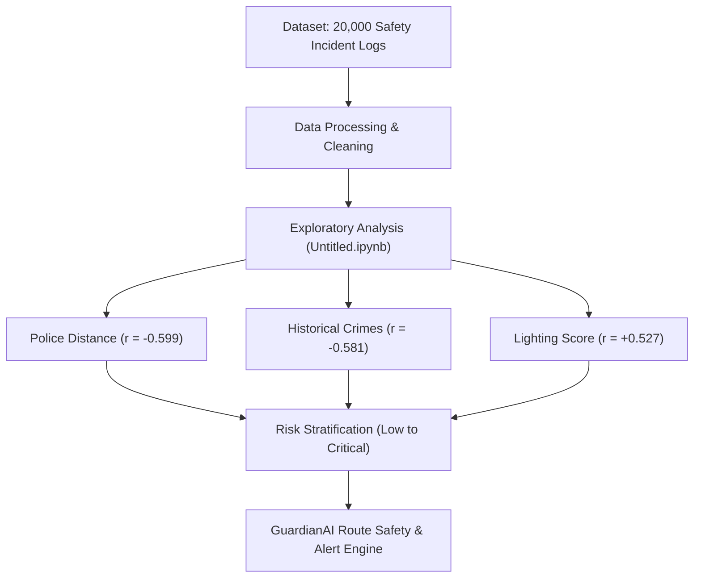

# 🛡️ GuardianAI

GuardianAI is an intelligent safety prediction and route risk estimation system designed to enhance safety monitoring and proactive alerting.

---

## 📁 Repository Structure

```
GuardianAI/
├── Analysis/
│   ├── README.md                              # Detailed Dataset & EDA Documentation
│   ├── Untitled.ipynb                         # Jupyter Notebook for Safety Data Analysis
│   └── Woman_Safety_Dataset_Management.csv    # Women Safety Dataset (20,000 records)
└── README.md                                  # Root Project Documentation
```

---

## 📊 Exploratory Data Analysis & Safety Insights

A comprehensive data analysis was conducted on `Woman_Safety_Dataset_Management.csv` containing 20,000 incident logs across 10 major Indian cities.

### Key Highlights:
- **Police Station Distance:** Single strongest factor affecting safety scores ($r = -0.599$).
- **Lighting Score:** High positive correlation with safety ($r = +0.527$).
- **Historical Crime Count:** Strong negative correlation with safety ($r = -0.581$).
- **Risk Profiles:** Critical & High risk areas average $> 5.9\text{ km}$ from the nearest police station.

---

## 🔄 System & Analysis Flowchart



---

For a full breakdown of dataset features, statistical summaries, correlations, and instructions to run the analysis notebook, see **[Analysis/README.md](file:///h:/Github/GuardianAI/Analysis/README.md)**.
