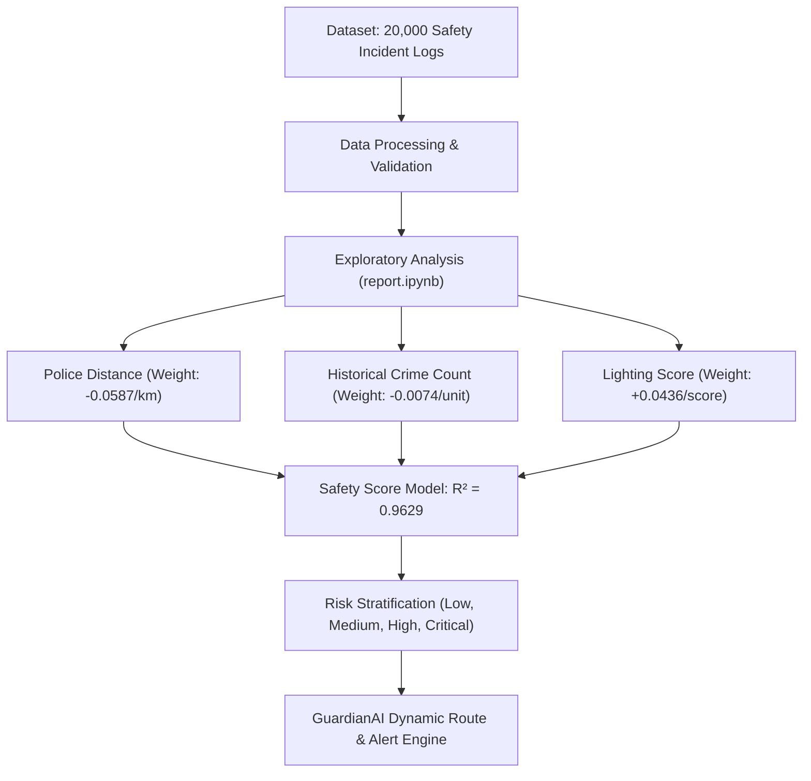

# 🛡️ GuardianAI

GuardianAI is an intelligent safety prediction and route risk estimation system designed to enhance safety monitoring, dynamic route assessment, and proactive alerting.

---

## 📁 Repository Structure

```
GuardianAI/
├── Analysis/
│   ├── README.md                              # Deep Dataset Analysis & Regression Derivations
│   ├── report.md                              # Exhaustive Analytical Markdown Report
│   ├── report.ipynb                           # Jupyter Notebook for Safety Data Analysis
│   └── Woman_Safety_Dataset_Management.csv    # Women Safety Dataset (20,000 records)
└── README.md                                  # Root Project Documentation
```

---

## 🌐 Dataset Source

The underlying geospatial dataset used for training, modeling, and analysis is available on Kaggle:
- 📊 **Kaggle Dataset:** [Indian Women Safety Geospatial Dataset](https://www.kaggle.com/datasets/soumyodipthanadar/indian-women-safety-geospatial-dataset)

---

## 🔄 System Architecture & Data Flow



---

## 📊 Key Dataset & Model Insights

A deep quantitative analysis of [`Woman_Safety_Dataset_Management.csv`](file:///h:/Github/GuardianAI/Analysis/Woman_Safety_Dataset_Management.csv) revealed the exact mathematical relationship governing safety scores ($R^2 = 0.9629$):

$$\text{Safety}_{\text{Score}} \approx 0.9593 + 0.0436 \times \text{Lighting}_{\text{Score}} - 0.0587 \times \text{PoliceDist}_{\text{km}} - 0.0074 \times \text{Crime}_{\text{Count}}$$

### Strategic Highlights:
- **Police Station Distance:** Primary hazard factor ($-0.0587$ per km). Critical risk areas average $7.03\text{ km}$ from stations.
- **Street Illumination:** Primary protective factor ($+0.0436$ per score point). Low risk areas average $6.70$ lighting score.
- **Risk Stratification:** $46.51\%$ Low Risk, $34.70\%$ Medium Risk, $16.30\%$ High Risk, $2.50\%$ Critical Risk.
- **Geospatial Coverage:** 10 major Indian metros (~2,000 incident logs per city), with Jaipur's *Vaishali Nagar* (0.6892) and Mumbai's *Dadar* (0.6921) registering the lowest average safety scores.
- **Weather & Seasonality:** Incidents span 5 weather states evenly (~20% each); May registered the highest cumulative crime volume (59,012).

For the complete statistical breakdown, city comparison matrices, cross-tabulations, weather distributions, and ML deployment recommendations, see **[Analysis/README.md](file:///h:/Github/GuardianAI/Analysis/README.md)**.

---

## 👥 Project Team & Contributors

- 👤 [Pampana Satya Kiran](http://psatyakiran.in/)
- 👤 **Amarthaluri Harshavardhan**
- 👤 **Madeli Narasimha**
- 👤 **Mammula Sneha**
- 👤 **Kadagala Meghana**

