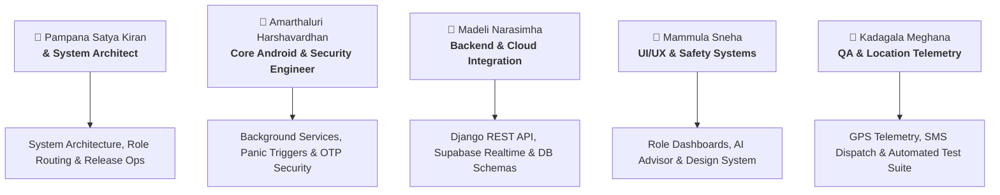

# 🛡️ GuardianAI — Team Allocation & Responsibility Matrix

> **Autonomous Women Safety, Telemetric Emergency Response, Multi-Role Command & Guardian Ecosystem**  
> *Project Work Breakdown and Responsibilities across native Android App and Django/Supabase Cloud Backend.*

---

## 📋 Executive Overview

**GuardianAI** is a mission-critical personal safety and incident command ecosystem consisting of two major repositories:
1. **[Android Client Application](file:///c:/Users/psaty/Videos/GuardianAI/App)**: Native Android app (Java + XML) featuring multi-modal emergency detection (1-tap SOS, shake detector, voice keyword recognition, dead-man switch timer), role-based home navigation, live ward telemetry radar, battery health monitoring, and real-time safety chat.
2. **[Django Cloud Backend & Dashboard](file:///c:/Users/psaty/Videos/GuardianAI/Backend)**: High-performance Django 6 REST framework API paired with Supabase Real-Time PostgreSQL, 6-digit cryptographic OTP authentication, Leaflet.js interactive dark radar command center, and multi-role data isolation.

To ensure seamless collaboration, modular development, and zero-conflict ownership, the complete ecosystem is distributed among **5 specialized team members**.

---

## 👥 Engineering Team & Core Assignments



---

## 📌 Detailed Work Breakdown by Member

---

### 1. 👤 Pampana Satya Kiran — System Architect
* **Primary Focus**: System Architecture, Role-Based Access Control (RBAC), Global Navigation Router, Build Orchestration & Cloud Deployment.

#### 📱 App Responsibilities ([App](file:///c:/Users/psaty/Videos/GuardianAI/App))
- **Role-Based Dynamic Navigation & Lifecycle**: Architecture and routing across `User`, `Guardian`, and `SuperAdmin` modes in [MainActivity.java](file:///c:/Users/psaty/Videos/GuardianAI/App/app/src/main/java/com\android\sheguard\ui\activity\MainActivity.java).
- **SuperAdmin Platform Control Center**: Developing [SuperAdminHomeFragment.java](file:///c:/Users/psaty/Videos/GuardianAI/App/app/src/main/java/com\android\sheguard\ui\fragment\SuperAdminHomeFragment.java) (KPI grid, platform user directory, system-wide active SOS monitor).
- **Central API Client & Retrofit Bridge**: Orchestrating network architecture in [ApiClient.java](file:///c:/Users/psaty/Videos/GuardianAI/App/app/src/main/java/com\android\sheguard\api\ApiClient.java) and [BackendApi.java](file:///c:/Users/psaty/Videos/GuardianAI/App/app/src/main/java/com\android\sheguard\api\BackendApi.java).
- **In-App Update & OTA Pipeline**: Managing automated releases via [AppUpdateManager.java](file:///c:/Users/psaty/Videos/GuardianAI/App/app/src/main/java/com\android\sheguard\util\AppUpdateManager.java) and [update.json](file:///c:/Users/psaty/Videos/GuardianAI/Apk/update.json).
- **Gradle & Release Engineering**: Multi-module Gradle configuration, signing keys, and APK packaging in [build.gradle](file:///c:/Users/psaty/Videos/GuardianAI/App/app/build.gradle).

#### 🖥️ Backend Responsibilities ([Backend](file:///c:/Users/psaty/Videos/GuardianAI/Backend))
- **Architecture & Server Configuration**: Main server setup, environment config, and routing in [settings.py](file:///c:/Users/psaty/Videos/GuardianAI/Backend/guardian_backend/settings.py) and [urls.py](file:///c:/Users/psaty/Videos/GuardianAI/Backend/guardian_backend/urls.py).
- **SuperAdmin Global Analytics & KPI API**: Implementation of `/api/dashboard/stats/` and platform stats endpoints in [views.py](file:///c:/Users/psaty/Videos/GuardianAI/Backend/guardian_api/views.py).
- **Hosting, Containerization & CI/CD**: Cloud hosting scripts ([Procfile](file:///c:/Users/psaty/Videos/GuardianAI/Backend/Procfile), [build.sh](file:///c:/Users/psaty/Videos/GuardianAI/Backend/build.sh), [runtime.txt](file:///c:/Users/psaty/Videos/GuardianAI/Backend/runtime.txt), and [HOST.md](file:///c:/Users/psaty/Videos/GuardianAI/HOST.md)).

---

### 2. 👤 Amarthaluri Harshavardhan — Core Android & Security Engineer
* **Primary Focus**: Sensor Triggers, Background Services, Panic Event Pipelines, Security Protocols & Widget Systems.

#### 📱 App Responsibilities ([App](file:///c:/Users/psaty/Videos/GuardianAI/App))
- **Continuous SOS Emergency Background Daemon**: Developing the high-priority foreground emergency service in [SosService.java](file:///c:/Users/psaty/Videos/GuardianAI/App/app/src/main/java/com\android\sheguard\service\SosService.java).
- **Dead-Man Switch & Safety Timer**: Timer countdown, safe check-in verification, and auto-escalation in [DeadMansSwitchService.java](file:///c:/Users/psaty/Videos/GuardianAI/App/app/src/main/java/com\android\sheguard\service\DeadMansSwitchService.java) and [SafetyTimerFragment.java](file:///c:/Users/psaty/Videos/GuardianAI/App/app/src/main/java/com\android\sheguard\ui\fragment\SafetyTimerFragment.java).
- **Hardware & Sensor Panic Triggers**:
  - Multi-press power/volume button listener in [HardwareButtonReceiver.java](file:///c:/Users/psaty/Videos/GuardianAI/App/app/src/main/java/com\android\sheguard\receiver\HardwareButtonReceiver.java).
  - Continuous voice recognition & keyword trigger (*"Help"*, *"Guardian SOS"*) in [VoiceSosFragment.java](file:///c:/Users/psaty/Videos/GuardianAI/App/app/src/main/java/com\android\sheguard\ui\fragment\VoiceSosFragment.java).
  - Shake gesture detection and siren audio generator in [SosUtil.java](file:///c:/Users/psaty/Videos/GuardianAI/App/app/src/main/java/com\android\sheguard\util\SosUtil.java).
- **Critical Battery Guardian (15% Auto-Alert)**: Low battery broadcast listener in [BatteryMonitorReceiver.java](file:///c:/Users/psaty/Videos/GuardianAI/App/app/src/main/java/com\android\sheguard\receiver\BatteryMonitorReceiver.java).
- **Home Screen Emergency Widgets**:
  - 1-Tap Emergency Panic Button (2x2) in [QuickSosWidgetProvider.java](file:///c:/Users/psaty/Videos/GuardianAI/App/app/src/main/java/com\android\sheguard\widget\QuickSosWidgetProvider.java).
  - Quick Safety Bar (4x1) in [SafetyBarWidgetProvider.java](file:///c:/Users/psaty/Videos/GuardianAI/App/app/src/main/java/com\android\sheguard\widget\SafetyBarWidgetProvider.java).
  - Guardian Safety Hub (4x2) in [SafetyHubWidgetProvider.java](file:///c:/Users/psaty/Videos/GuardianAI/App/app/src/main/java/com\android\sheguard\widget\SafetyHubWidgetProvider.java).

#### 🖥️ Backend Responsibilities ([Backend](file:///c:/Users/psaty/Videos/GuardianAI/Backend))
- **6-Digit Cryptographic OTP Vault & Auth Flow**: Endpoints `/api/auth/send-otp/` and `/api/auth/verify-otp/` in [guardian_api/views.py](file:///c:/Users/psaty/Videos/GuardianAI/Backend/guardian_api/views.py).
- **Transactional Email Dispatch**: Integration with Resend service for secure passcode delivery in [resend_mailer.py](file:///c:/Users/psaty/Videos/GuardianAI/Backend/guardian_api/resend_mailer.py).

---

### 3. 👤 Madeli Narasimha — Backend & Cloud Integration
* **Primary Focus**: Django REST API Development, Supabase Real-Time PostgreSQL Synchronization, Data Modeling & Real-Time Chat Engine.

#### 🖥️ Backend Responsibilities ([Backend](file:///c:/Users/psaty/Videos/GuardianAI/Backend))
- **Database Architecture & ORM Models**: Designing and maintaining schema models (`GuardianUser`, `EmergencyAlert`, `GuardianLink`, `ChatMessage`, `OTPRecord`) in [models.py](file:///c:/Users/psaty/Videos/GuardianAI/Backend/guardian_api/models.py).
- **Supabase Cloud Synchronization**: Real-time cloud sync, table migrations, and direct PostgreSQL queries in [supabase_client.py](file:///c:/Users/psaty/Videos/GuardianAI/Backend/guardian_api/supabase_client.py) and [supabase_schema.sql](file:///c:/Users/psaty/Videos/GuardianAI/Backend/supabase_schema.sql).
- **REST API Serializers & Validation**: Data validation and response formatting in [serializers.py](file:///c:/Users/psaty/Videos/GuardianAI/Backend/guardian_api/serializers.py).
- **Guardian Link & Ward Relationship Engine**: Pairing endpoints (`/api/guardians/link/`, `/api/guardians/my-guardians/`, `/api/guardians/tracked-wards/`) with strict isolation rules in [views.py](file:///c:/Users/psaty/Videos/GuardianAI/Backend/guardian_api/views.py).
- **Real-Time Safety Chat Backend**: Endpoints `/api/chat/send/` and `/api/chat/history/` with quick-reply situational presets.
- **Server Health & Keep-Alive Daemon**: Background ping daemon preventing cloud instance sleep in [keep_alive.py](file:///c:/Users/psaty/Videos/GuardianAI/Backend/guardian_api/keep_alive.py).

#### 📱 App Responsibilities ([App](file:///c:/Users/psaty/Videos/GuardianAI/App))
- **Data Models & Entities**: Android Java POJO entity definitions in [com.android.sheguard.model](file:///c:/Users/psaty/Videos/GuardianAI/App/app/src/main/java/com\android\sheguard\model).
- **Firebase Push Notification Receiver**: Cloud messaging receiver bridge in [FireBaseMessageService.java](file:///c:/Users/psaty/Videos/GuardianAI/App/app/src/main/java/com\android\sheguard\service\FireBaseMessageService.java) and [FirebaseUtil.java](file:///c:/Users/psaty/Videos/GuardianAI/App/app/src/main/java/com\android\sheguard\util\FirebaseUtil.java).

---

### 4. 👤 Mammula Sneha — UI/UX & Safety Systems
* **Primary Focus**: Design Systems, Interactive Mobile UI, AI Safety Assistant, Multilingual Localization & Web Command Radar UI.

#### 📱 App Responsibilities ([App](file:///c:/Users/psaty/Videos/GuardianAI/App))
- **Protected Citizen Safety Hub**: Designing and building the primary home screen in [HomeFragment.java](file:///c:/Users/psaty/Videos/GuardianAI/App/app/src/main/java/com\android\sheguard\ui\fragment\HomeFragment.java) (pulsating SOS button, quick action grid, emergency tips).
- **Guardian Command Desk Mobile UI**: Building the protector view in [GuardianHomeFragment.java](file:///c:/Users/psaty/Videos/GuardianAI/App/app/src/main/java/com\android\sheguard\ui\fragment\GuardianHomeFragment.java) and [GuardianPortalFragment.java](file:///c:/Users/psaty/Videos/GuardianAI/App/app/src/main/java/com\android\sheguard\ui\fragment\GuardianPortalFragment.java) with dynamic battery color gauges and empty-state actions.
- **Interactive Two-Way Safety Chat Interface**: Chat UI, bubble layouts, quick response chips, and live battery header in [GuardianChatFragment.java](file:///c:/Users/psaty/Videos/GuardianAI/App/app/src/main/java/com\android\sheguard\ui\fragment\GuardianChatFragment.java).
- **24/7 AI Safety Assistant**: LLM crisis advisor integration with Groq API in [AiAssistantFragment.java](file:///c:/Users/psaty/Videos/GuardianAI/App/app/src/main/java/com\android\sheguard\ui\fragment\AiAssistantFragment.java) and [GroqAiUtil.java](file:///c:/Users/psaty/Videos/GuardianAI/App/app/src/main/java/com\android\sheguard\util\GroqAiUtil.java).
- **Escort & Evasion Simulation Tools**:
  - Realistic incoming call simulator in [FakeCallActivity.java](file:///c:/Users/psaty/Videos/GuardianAI/App/app/src/main/java/com\android\sheguard\ui\activity\FakeCallActivity.java).
  - Safe ride cab logger in [SafeRideFragment.java](file:///c:/Users/psaty/Videos/GuardianAI/App/app/src/main/java/com\android\sheguard\ui\fragment\SafeRideFragment.java) and [SafeRouteFragment.java](file:///c:/Users/psaty/Videos/GuardianAI/App/app/src/main/java/com\android\sheguard\ui\fragment\SafeRouteFragment.java).
- **User Onboarding & Authentication UI**: Modern onboarding carousel in [OnBoardingActivity.java](file:///c:/Users/psaty/Videos/GuardianAI/App/app/src/main/java/com\android\sheguard\ui\activity\OnBoardingActivity.java), [LoginFragment.java](file:///c:/Users/psaty/Videos/GuardianAI/App/app/src/main/java/com\android\sheguard\ui\fragment\LoginFragment.java), and [RegisterFragment.java](file:///c:/Users/psaty/Videos/GuardianAI/App/app/src/main/java/com\android\sheguard\ui\fragment\RegisterFragment.java).
- **Design System, Themes & Localization**:
  - Material Design layouts in `res/layout/`, custom drawable shapes in `res/drawable/`.
  - Light, Dark, and Pure AMOLED Black themes in [ThemeUtil.java](file:///c:/Users/psaty/Videos/GuardianAI/App/app/src/main/java/com\android\sheguard\util\ThemeUtil.java).
  - Multilingual support (English, Telugu, Hindi) in [LocaleUtil.java](file:///c:/Users/psaty/Videos/GuardianAI/App/app/src/main/java/com\android\sheguard\util\LocaleUtil.java) and `res/values/strings.xml`.

#### 🖥️ Backend Responsibilities ([Backend](file:///c:/Users/psaty/Videos/GuardianAI/Backend))
- **Web Command Dashboard Frontend**: Responsive HTML5/CSS3 templates for incident command in [Backend/dashboard/templates/](file:///c:/Users/psaty/Videos/GuardianAI/Backend/dashboard/templates) (`index.html`, `guardian_hub.html`, `login.html`, `users.html`, `otp_log.html`).
- **Interactive Leaflet.js Radar UI**: Dynamic client-side map styling with pulsing SOS markers and unit radars in [Backend/dashboard/static/](file:///c:/Users/psaty/Videos/GuardianAI/Backend/dashboard/static).

---

### 5. 👤 Kadagala Meghana — QA & Location Telemetry
* **Primary Focus**: GPS Location Engine, Emergency Dispatch Fan-Out, Quality Assurance, Automated Testing & Verification.

#### 📱 App Responsibilities ([App](file:///c:/Users/psaty/Videos/GuardianAI/App))
- **Location Telemetry Engine**: GPS coordinate polling, reverse geocoding to street address, and high-accuracy fixes in [LocationHelper.java](file:///c:/Users/psaty/Videos/GuardianAI/App/app/src/main/java/com\android\sheguard\util\LocationHelper.java).
- **Multi-Channel Emergency SMS & WhatsApp Fan-Out**: Automated dispatch of emergency alerts with live Google Maps link via [SmsHelper.java](file:///c:/Users/psaty/Videos/GuardianAI/App/app/src/main/java/com\android\sheguard\util\SmsHelper.java).
- **Emergency Contacts & Helpline Directory**:
  - Managing trusted phone contacts in [ContactsFragment.java](file:///c:/Users/psaty/Videos/GuardianAI/App/app/src/main/java/com\android\sheguard\ui\fragment\ContactsFragment.java).
  - Assigned guardian directory in [MyGuardiansFragment.java](file:///c:/Users/psaty/Videos/GuardianAI/App/app/src/main/java/com\android\sheguard\ui\fragment\MyGuardiansFragment.java).
  - Direct 112 / Women Helpline fast-dialer in [HelplineFragment.java](file:///c:/Users/psaty/Videos/GuardianAI/App/app/src/main/java/com\android\sheguard\ui\fragment\HelplineFragment.java).
  - Journey tracking in [TripMonitorFragment.java](file:///c:/Users/psaty/Videos/GuardianAI/App/app/src/main/java/com\android\sheguard\ui\fragment\TripMonitorFragment.java).

#### 🖥️ Backend Responsibilities ([Backend](file:///c:/Users/psaty/Videos/GuardianAI/Backend))
- **Location Telemetry & SOS Ingestion Endpoints**: Ingestion of GPS beacons and emergency alerts (`/api/location/ping/`, `/api/sos/trigger/`, `/api/sos/resolve/`) in [guardian_api/views.py](file:///c:/Users/psaty/Videos/GuardianAI/Backend/guardian_api/views.py).
- **Comprehensive Automated Test Suite**:
  - Writing and maintaining end-to-end integration tests in [test_guardian_system.py](file:///c:/Users/psaty/Videos/GuardianAI/Backend/test_guardian_system.py).
  - Verifying multi-role data isolation (User, Guardian, SuperAdmin).
  - Validating battery warning alerts, 403 Forbidden checks, and OTP transaction verification.
- **Web Dashboard Telemetry Views**: Developing backend view handlers in [dashboard/views.py](file:///c:/Users/psaty/Videos/GuardianAI/Backend/dashboard/views.py) and telemetry feeds.

---

## 📊 Responsibility Assignment (RACI) Matrix

| Module / Deliverable | Satya Kiran (PSK) | Harshavardhan (AH) | Narasimha (MN) | Sneha (MS) | Meghana (KM) |
| :--- | :---: | :---: | :---: | :---: | :---: |
| **System Architecture & App Routing** | **A / R** | C | C | C | I |
| **SuperAdmin Mobile Control Center** | **A / R** | I | C | C | I |
| **APK Build, OTA & Releases** | **A / R** | C | I | I | C |
| **Background SOS & Panic Service** | C | **A / R** | I | I | C |
| **Hardware Buttons & Voice Trigger** | I | **A / R** | I | C | I |
| **Dead-Man Switch & Safety Timer** | I | **A / R** | I | C | C |
| **Home Screen Widgets (1-Tap SOS, Bar)**| I | **A / R** | I | C | I |
| **OTP Security Vault & Mailer** | C | **R** | **A** | I | C |
| **Django REST API & Database Models** | C | I | **A / R** | I | C |
| **Supabase Realtime PostgreSQL Sync** | C | I | **A / R** | I | I |
| **Guardian-Ward Pairing API** | C | I | **A / R** | C | C |
| **Protected User Home UI (SheGuard)** | I | C | I | **A / R** | C |
| **Guardian Command Desk Mobile UI** | C | I | C | **A / R** | C |
| **24/7 AI Safety Assistant (Groq LLM)** | I | I | I | **A / R** | I |
| **Fake Call Simulator & Safe Ride** | I | C | I | **A / R** | I |
| **Design System, Themes & Localization**| I | I | I | **A / R** | I |
| **Web Radar Command Dashboard UI** | C | I | C | **A / R** | C |
| **GPS Tracking & Reverse Geocoding** | I | C | C | I | **A / R** |
| **SMS / WhatsApp Emergency Fan-Out** | I | C | I | I | **A / R** |
| **Emergency Contacts & Helpline Desk** | I | I | I | C | **A / R** |
| **Automated End-to-End Test Suite** | C | C | C | I | **A / R** |

*Legend: **R** = Responsible, **A** = Accountable, **C** = Consulted, **I** = Informed*

---

## 🛠️ Technology Stack by Domain

```
GuardianAI Ecosystem
├── 📱 Mobile Client (Java & XML) ────────────── Satya Kiran (Lead), Harshavardhan, Sneha, Meghana
│   ├── Architecture: MVC / Fragment-Activity Single Task Router
│   ├── Networking: Retrofit 2 + OkHttp3 + Gson
│   ├── Sensors: Android SensorManager (Accelerometer), SpeechRecognizer, LocationServices (FusedLocation)
│   ├── Background: Foreground Services + BroadcastReceivers + AlarmManager
│   ├── Widgets: AppWidgetProvider (RemoteViews)
│   ├── AI Engine: Groq LLM API (Mixtral / Llama 3)
│   └── UI/UX: Material Components, Dynamic Dark/AMOLED Theme, Multilingual i18n
│
├── 🖥️ Backend API & Command Center (Python) ── Narasimha (Lead), Satya Kiran, Meghana, Sneha
│   ├── Framework: Django 6.0 + Django REST Framework (DRF)
│   ├── Cloud DB: Supabase (PostgreSQL with Realtime WebSockets)
│   ├── Auth: 6-Digit Time-Sensitive OTP Vault + Role-Based Token Scoping
│   ├── Communications: Resend Transactional Email API + Twilio SMS
│   └── Web Dashboard: Leaflet.js, OpenStreetMap, HTML5 Glassmorphic UI
│
└── 🧪 Verification & QA ──────────────────────── Meghana (Lead), Satya Kiran, Narasimha
    ├── Integration Testing: Python Requests + PyTest E2E Suite (test_guardian_system.py)
    └── Security Auditing: Strict 403 Scoping, Cross-Ward Isolation Checks
```

---

## 🚀 Collaboration & Branching Strategy

To prevent merge conflicts across the Android and Django codebases:

1. **`main`**: Production-ready, verified builds (releases synced to [Apk/GuardianAI-debug.apk](file:///c:/Users/psaty/Videos/GuardianAI/Apk/GuardianAI-debug.apk)).
2. **`feature/android-security-sensors`** *(Harshavardhan)*: Background services, trigger sensors, widgets.
3. **`feature/backend-supabase-api`** *(Narasimha)*: Models, Supabase sync, chat and link APIs.
4. **`feature/app-ui-and-ai`** *(Sneha)*: XML layouts, fragment controllers, AI Assistant, themes.
5. **`feature/qa-telemetry-dispatch`** *(Meghana)*: GPS telemetry, SMS dispatch, automated test coverage.
6. **`feature/architecture-superadmin`** *(Satya Kiran)*: Core router, SuperAdmin suite, CI/CD, and release assembly.

---

## 📞 Team Contacts & Repository Links

- 🌐 **Project Repository**: [GitHub - satyakiran29/GuardianAI](https://github.com/satyakiran29/GuardianAI)
- 🌐 **Live Web Command Center**: [http://127.0.0.1:8000/](http://127.0.0.1:8000/)
- 📱 **Latest Android Build**: [Download APK (v1.1.3)](file:///c:/Users/psaty/Videos/GuardianAI/Apk/GuardianAI-debug.apk)
- 📖 **System Documentation**: [README.md](file:///c:/Users/psaty/Videos/GuardianAI/README.md) • [HOST.md](file:///c:/Users/psaty/Videos/GuardianAI/HOST.md)
